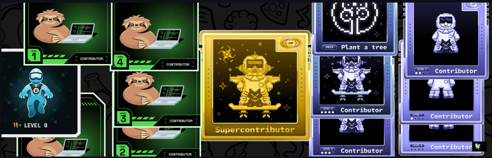

# 💫 About Me:  

  

🔭 I'm currently working on projects that solve real-life problems and make the world a better place.     
💬 Ask me about Web Development, Programming, or anything tech-related!   
📫 How to reach me: **lakshyasxn7351@gmail.com**   
😄 Pronouns: He/Him   

### Holopin Dashboard

<!-- # Socials

  

  

  

  

 -->

<!--  -->

<!-- 

 -->

## 💻 Tech Stack   
 
 
 
 
 
 
 

---
 
 
 
  
 
 
  
  
  
 
 
 
 
  

## 📊 GitHub Stats  
<!--   -->

  

  
  

  
  

## 📈 Contribution Graph  
  

